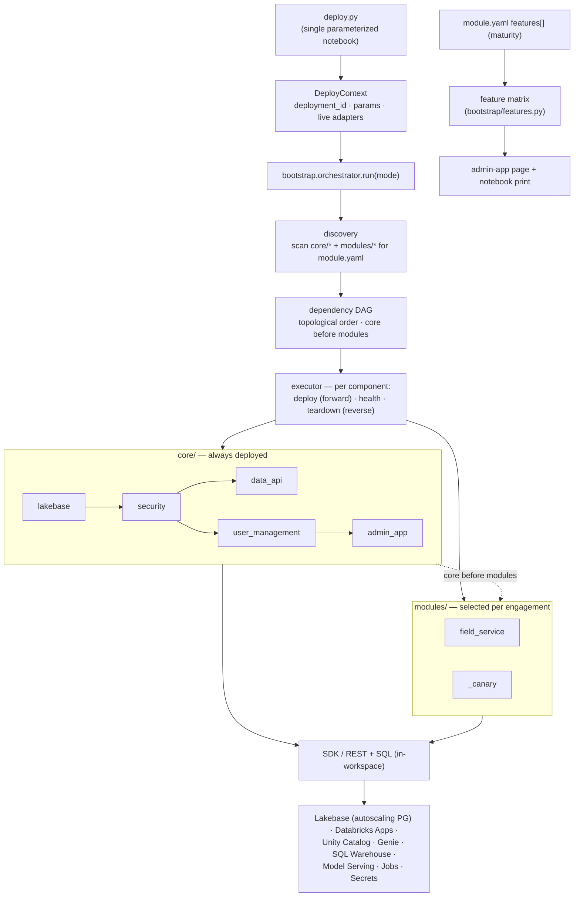

# lakebase-solutions

A reusable, **modular foundation for Databricks Lakebase workshops** that
Solutions Architects run with their customers. It always deploys Lakebase and
its supporting **core** components, then layers optional **modules** chosen per
engagement (by problem area or persona). Deployment is immutable/repeatable and
driven by a **single parameterized notebook** — and **adding a module never
requires editing that notebook**.

## What it is

- **Core (always deployed):** `lakebase`, `security`, `user_management`,
  `data_api`, `admin_app` (the single always-on app — a Lakebase DBA console).
- **Modules (optional):** each in `modules/<name>/`, with its **own** Databricks
  App and resources. `modules/_canary/` is the reference module.
- **Control plane:** `deploy.py` (a Databricks notebook) collects parameters and
  calls the `bootstrap/` engine, which discovers components/modules from
  `module.yaml` manifests, orders them by dependency, and deploys or tears down.

## Architecture

The single `deploy.py` notebook builds a `DeployContext` and hands it to the
`bootstrap/` engine, which **discovers** every `core/` component and the
**selected** `modules/`, orders them by dependency (core always before modules),
and runs each component's `deploy` / `health_check` / `teardown`. Every component
provisions **in-workspace via the Databricks SDK / REST + SQL** (the CLI can't run
in job compute). Each component declares its Databricks `features` + maturity,
which the engine aggregates into a customer-facing **feature matrix**.



## Quickstart

Deployment runs **inside Databricks** (commit → push → pull → run); there is no
laptop CLI execution.

1. `cp config.template.yaml config.yaml` and set advanced params (optional).
2. Open `deploy.py` in the workspace. Set widgets:
   - **required:** `deployment_id` (prefix that namespaces everything)
   - **optional:** `mode` (`deploy`/`teardown`), `cloud`, `region`,
     `autoscaling_min_cu`, `autoscaling_max_cu`, `admin_group`,
     `workshop_group`, `enable_data_api`, `modules`
3. Run. The notebook discovers core + selected modules, orders them, and
   deploys. `mode: teardown` removes everything in reverse.
4. **Data API is two-phase:** the notebook prints a manual UI-enable
   instruction; re-run afterward to configure the SP/role/RLS.

## Repository structure

```
bootstrap/            orchestrator engine (discovery, manifest schema, DAG, context, run)
core/                 always-on components, one dir each (module.yaml + deploy/teardown/health)
  lakebase/  security/  user_management/  data_api/  admin_app/
modules/              optional workshop modules
  _canary/            reference module + authoring template (real, minimal)
  field_service/      full field-service solution (data, Genie, dashboards, ML, agent, app)
deploy.py             single control-plane notebook (dbutils-guarded; importable off-Databricks)
databricks.yml        DABs bundle — local/CI `bundle validate` only (runtime provisioning is SDK/REST)
config.template.yaml  copy to config.yaml for advanced params
tests/                pytest suite (manifests, DAG, orchestrator, notebook import) — no workspace
docs/                 ARCHITECTURE.md, MODULE_AUTHORING.md
.github/workflows/    CI (gitleaks secret scan + pytest)
```

## Key design decisions

- **Autoscaling Lakebase.** The **autoscaling `postgres` projects/branches/
  endpoints** surface (min/max CU + scale-to-zero), NOT the provisioned
  `database_instance` tier. PG roles/grants via `CREATE ROLE` SQL. See
  [`docs/ARCHITECTURE.md`](docs/ARCHITECTURE.md).
- **In-workspace SDK/REST provisioning.** The `databricks` CLI (incl. `bundle
  deploy`) cannot run in notebook/job compute, so every resource is provisioned
  via the Databricks Python SDK / REST (`w.api_client.do` for the `postgres`,
  `apps`, and other surfaces not typed on the runtime SDK). `databricks.yml` is
  retained for local/CI `bundle validate` only.
- **Manifest-driven discovery.** The notebook never changes when a module is
  added; modules are found by scanning for `module.yaml`.
- **Standalone assets.** Every module gets its own app, PG roles, and secret
  keys — nothing reused across apps.
- **Maturity transparency.** Preview-or-better features are allowed, and each
  component declares its features' maturity (GA / Public Preview / Beta),
  surfaced as a feature matrix so customers always see what isn't GA.

## Develop

```bash
pip install -r requirements-dev.txt
make check         # pure-Python; no Databricks workspace needed
```

To author a module, see [`docs/MODULE_AUTHORING.md`](docs/MODULE_AUTHORING.md)
and copy `modules/_canary/`.

## How to get help

Databricks support doesn't cover this content. For questions or bugs, please open
a GitHub issue and the team will help on a best effort basis.

## License

&copy; 2025 Databricks, Inc. All rights reserved. The source in this notebook is
provided subject to the Databricks License [https://databricks.com/db-license-source].
All included or referenced third party libraries are subject to the licenses set
forth below.

| library | description | license | source |
|---------|-------------|---------|--------|
| PyYAML | YAML parser | MIT | https://github.com/yaml/pyyaml |
| pytest | Test framework (dev) | MIT | https://github.com/pytest-dev/pytest |
