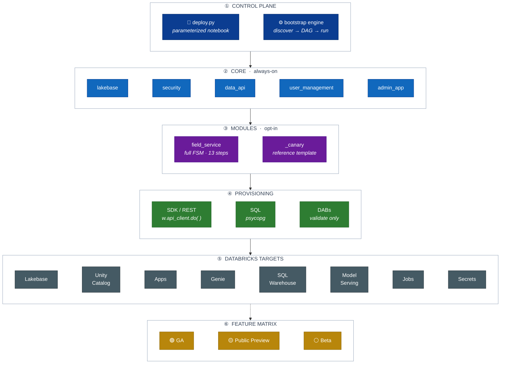

# lakebase-solutions

A reusable, **modular foundation for Databricks Lakebase workshops** that
Solutions Architects run with their customers. It always deploys Lakebase and
its supporting **core** components, then layers optional **modules** chosen per
engagement (by problem area or persona). Deployment is immutable/repeatable and
driven by a **single parameterized notebook** — and **adding a module never
requires editing that notebook**.

## Business case

Customers increasingly want their **operational (OLTP) apps, analytics, and AI on
one governed platform**. This repo lets a Solutions Architect stand up exactly
that story with a customer in minutes: **Lakebase** (Postgres) as the operational
database, with Unity Catalog governance, Genie, dashboards, ML/agents, and
Databricks Apps layered on top — reproducibly, and torn down just as easily after
the workshop.

The flagship module, **`field_service`**, is a Telco **field-service management**
solution (work orders, dispatch, technicians, fleet telemetry, SLA tracking). It
shows Lakebase powering a live app while the rest of the platform delivers
natural-language analytics, predictive maintenance, and governance over the *same*
data — the "one platform, no data movement" pitch, made concrete.

## Databricks services this covers

| Service | Where it's used |
|---|---|
| **Lakebase** (autoscaling Postgres OLTP) | Core operational DB — schema, roles, real-time app data |
| **Databricks Apps** | Admin DBA console (core) + the field-service app (module) |
| **Unity Catalog** | Managed online catalog over Lakebase; governance (RLS, PII masking, tags) |
| **Lakebase Data API** (PostgREST) | Governed REST access to the OLTP data (two-phase enable) |
| **AI/BI Genie** | 4 conversational-analytics spaces (field ops, DBA, network, SLA) |
| **Databricks SQL** (serverless warehouse) | Powers Genie + dashboards + catalog queries |
| **Lakeview dashboards** | Field-service + network-ops dashboards |
| **Lakeflow Declarative Pipelines + Managed Iceberg** | Streaming network/IoT medallion pipeline |
| **Mosaic AI Model Serving** | Predictive-maintenance model endpoint |
| **Mosaic AI Agent Framework** (LangGraph) | Multi-Genie supervisor agent |
| **MLflow + UC model registry** | Model tracking + registration |
| **Databricks Jobs** | Scheduled ops (ASH sampler, cleanup, credential rotation) |
| **Secrets + service principals** | Standalone per-deployment credentials |

Each component declares its features' **maturity** (GA / Public Preview / Beta),
surfaced as a matrix so customers always see what isn't GA.

## What it is

- **Core (always deployed):** `lakebase`, `security`, `user_management`,
  `data_api`, `admin_app` (the single always-on app — a Lakebase DBA console).
- **Modules (optional):** each in `modules/<name>/`, with its **own** Databricks
  App and resources. `modules/_canary/` is the reference module.
- **Control plane:** `deploy.py` (a Databricks notebook) collects parameters and
  calls the `bootstrap/` engine, which discovers components/modules from
  `module.yaml` manifests, orders them by dependency, and deploys or tears down.

## Architecture

One `deploy.py` notebook hands a `DeployContext` to the `bootstrap/` engine,
which **discovers** `core/` + the **selected** `modules/`, orders them by
dependency (core before modules), and runs each one's
`deploy` / `health_check` / `teardown` — provisioning **in-workspace via the
Databricks SDK / REST + SQL**. Read the stack as bands, top to bottom; each
band is one tier, and the boxes in it are its components.



Each band is a horizontal row of short boxes, so the whole stack is six
tiers tall instead of a long scroll — GA / Preview colors on the bottom band
make the maturity story readable at a glance.

## Quickstart

Deployment runs **inside Databricks** (commit → push → pull → run); there is no
laptop CLI execution.

1. `cp config.template.yaml config.yaml` and set advanced params (optional).
2. Open `deploy.py` in the workspace. Set widgets:
   - **required:** `deployment_id` (prefix that namespaces everything)
   - **optional:** `mode` (`deploy`/`teardown`), `cloud`, `region`,
     `autoscaling_min_cu`, `autoscaling_max_cu`, `admin_group`,
     `workshop_group`, `enable_data_api`, `modules`
3. Run. The notebook discovers core + selected modules, orders them, and
   deploys. `mode: teardown` removes everything in reverse.
4. **Data API is two-phase:** the notebook prints a manual UI-enable
   instruction; re-run afterward to configure the SP/role/RLS.

## Repository structure

```
bootstrap/            orchestrator engine (discovery, manifest schema, DAG, context, run)
core/                 always-on components, one dir each (module.yaml + deploy/teardown/health)
  lakebase/  security/  user_management/  data_api/  admin_app/
modules/              optional workshop modules
  _canary/            reference module + authoring template (real, minimal)
  field_service/      full field-service solution (data, Genie, dashboards, ML, agent, app)
deploy.py             single control-plane notebook (dbutils-guarded; importable off-Databricks)
databricks.yml        DABs bundle — local/CI `bundle validate` only (runtime provisioning is SDK/REST)
config.template.yaml  copy to config.yaml for advanced params
tests/                pytest suite (manifests, DAG, orchestrator, notebook import) — no workspace
docs/                 ARCHITECTURE.md, MODULE_AUTHORING.md
.github/workflows/    CI (gitleaks secret scan + pytest)
```

## Key design decisions

- **Autoscaling Lakebase.** The **autoscaling `postgres` projects/branches/
  endpoints** surface (min/max CU + scale-to-zero), NOT the provisioned
  `database_instance` tier. PG roles/grants via `CREATE ROLE` SQL. See
  [`docs/ARCHITECTURE.md`](docs/ARCHITECTURE.md).
- **In-workspace SDK/REST provisioning.** The `databricks` CLI (incl. `bundle
  deploy`) cannot run in notebook/job compute, so every resource is provisioned
  via the Databricks Python SDK / REST (`w.api_client.do` for the `postgres`,
  `apps`, and other surfaces not typed on the runtime SDK). `databricks.yml` is
  retained for local/CI `bundle validate` only.
- **Manifest-driven discovery.** The notebook never changes when a module is
  added; modules are found by scanning for `module.yaml`.
- **Standalone assets.** Every module gets its own app, PG roles, and secret
  keys — nothing reused across apps.
- **Maturity transparency.** Preview-or-better features are allowed, and each
  component declares its features' maturity (GA / Public Preview / Beta),
  surfaced as a feature matrix so customers always see what isn't GA.

## Develop

```bash
pip install -r requirements-dev.txt
make check         # pure-Python; no Databricks workspace needed
```

To author a module, see [`docs/MODULE_AUTHORING.md`](docs/MODULE_AUTHORING.md)
and copy `modules/_canary/`.

## How to get help

Databricks support doesn't cover this content. For questions or bugs, please open
a GitHub issue and the team will help on a best effort basis.

## License

&copy; 2025 Databricks, Inc. All rights reserved. The source in this notebook is
provided subject to the Databricks License [https://databricks.com/db-license-source].
All included or referenced third party libraries are subject to the licenses set
forth below.

| library | description | license | source |
|---------|-------------|---------|--------|
| PyYAML | YAML parser | MIT | https://github.com/yaml/pyyaml |
| pytest | Test framework (dev) | MIT | https://github.com/pytest-dev/pytest |
