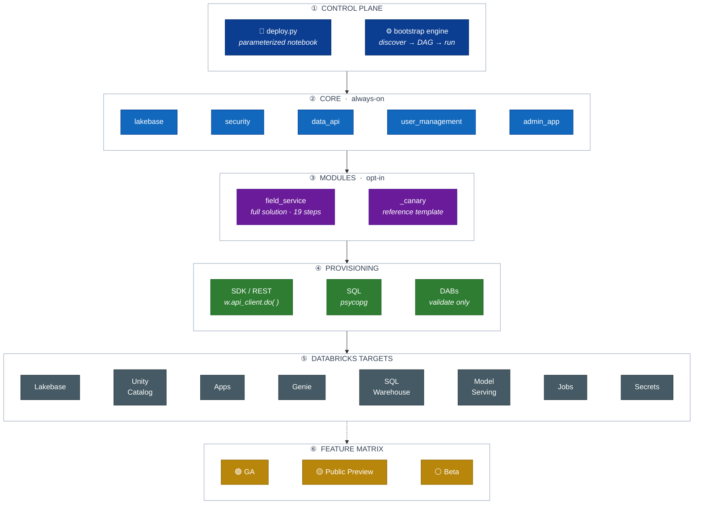

# lakebase-solutions

Stand up a complete **Databricks Lakebase workshop** — Lakebase (Postgres) as the
operational database, with the surrounding platform (Unity Catalog, Genie,
dashboards, ML/agents, Databricks Apps) — in a **single run**, and tear it all
back down just as fast. It always deploys Lakebase + supporting **core**
components, then layers optional **modules** you choose. Everything is
namespaced by a `deployment_id`, so multiple workshops coexist in one workspace.

This repo is for **anyone with the Databricks skills to deploy it** — you don't
need to have written it. You can run it yourself from a notebook, or hand it to a
coding agent (see [Deploy it](#deploy-it)).

## Prerequisites
- A **serverless-enabled** Databricks workspace where you can create Lakebase
  (autoscaling `postgres`) projects, Unity Catalog objects, SQL warehouses, Apps,
  and jobs.
- Permission to add a **Git folder** (Repos) and run notebooks/jobs on serverless.

## Deploy it

### Option A — from the workspace (simplest)
1. **Add this repo as a Git folder:** Workspace → *Git folders* → *Add* →
   `https://github.com/databricks-solutions/lakebase-solutions`.
2. **Open [`deploy.py`](deploy.py)** and set the widgets:
   - `deployment_id` *(required)* — a short prefix that namespaces everything (e.g. `acme-ws`).
   - `modules` — comma-separated module names to include (e.g. `field_service`). Leave blank for core-only.
   - *(optional)* `mode` (`deploy`/`teardown`), `cloud`, `region`,
     `autoscaling_min_cu`, `autoscaling_max_cu`, `admin_group`, `workshop_group`, `enable_data_api`.
3. **Run all.** The notebook discovers core + your selected modules, orders them
   by dependency, and provisions everything.
4. **Data API is two-phase:** the run prints a one-time manual "enable" step;
   re-run afterward to finish configuring it.

### Option B — with a coding agent
Point a coding agent (the Databricks Assistant / Genie, Claude Code, Cursor, …)
at this repo and let it drive the deploy. It reads [`AGENTS.md`](AGENTS.md), which
documents the exact workflow, then runs it for you. A prompt like:

> *"Deploy lakebase-solutions to my Databricks workspace with the `field_service`
> module, deployment_id `acme-ws`."*

is enough — the agent handles syncing the Git folder and running the deploy
notebook / job. (It needs the same workspace access as Option A.)

## Tear it down
Same notebook, one change: set **`mode` = `teardown`** with the **same
`deployment_id` and `modules`**, and *Run all*. It removes everything it created —
project, catalogs, warehouse, apps, jobs, endpoints, secrets — in reverse order.
(Or tell your agent: *"tear down the `acme-ws` deployment."*)

## What gets deployed

**Core (always deployed):**

| Component | Provisions |
|---|---|
| `lakebase` | Autoscaling Postgres project + branch/endpoint, the workshop database + schema |
| `security` | Per-deployment PG app + read-only roles, grants, and a standalone secret scope |
| `user_management` | Workspace admin/participant groups + a participant PG role |
| `data_api` | Governed PostgREST access to the OLTP data (two-phase enable) |
| `admin_app` | A Lakebase DBA console (Databricks App) |

**Modules (opt-in, one per `modules/<name>/`, each with its own app + resources):**
see the **[module inventory →](modules/README.md)** for what each one deploys.
The flagship is **`field_service`** — a full field-service solution spanning
Lakebase, a managed online catalog, a Lakeflow/Iceberg pipeline, 4 Genie spaces,
Lakeview dashboards, predictive-maintenance + fleet + dispatch ML, a multi-Genie
agent, and a live app.

Every component declares its features' **maturity** (GA / Public Preview / Beta),
aggregated into a **feature matrix** so it's always clear what isn't GA.

## Architecture

One [`deploy.py`](deploy.py) notebook hands a `DeployContext` to the `bootstrap/`
engine, which **discovers** `core/` + the **selected** `modules/`, orders them by
dependency (core before modules), and runs each one's
`deploy` / `health_check` / `teardown` — provisioning **in-workspace via the
Databricks SDK / REST + SQL**.



## Design principles (why it deploys the way it does)
- **Autoscaling Lakebase** — the autoscaling `postgres` projects/branches/endpoints
  surface (min/max CU + scale-to-zero); PG roles/grants via `CREATE ROLE` SQL.
- **In-workspace SDK/REST provisioning** — the `databricks` CLI can't run on
  notebook/job compute, so everything is provisioned via the Python SDK / REST.
  `databricks.yml` is kept for local/CI `bundle validate` only.
- **Manifest-driven discovery** — adding a module never edits the deploy notebook;
  drop a folder with a `module.yaml` and the dependency DAG picks it up.
- **Standalone assets** — every deployment/module gets its own app, PG roles, and
  secrets; nothing is reused across apps, and no secrets live in git.
- **Repeatable + reversible** — the same run tears down cleanly by `deployment_id`.

## Repository layout
```
bootstrap/   orchestrator engine (discovery, manifest schema, dependency DAG, context)
core/        always-on components: lakebase, security, user_management, data_api, admin_app
modules/     opt-in modules (see modules/README.md) — _canary (reference), field_service
deploy.py    single control-plane notebook (deploy + teardown)
tests/       offline pytest suite (no Databricks workspace needed)
docs/        ARCHITECTURE.md, MODULE_AUTHORING.md
```

## Contributing
`main` is protected — **branch and open a Pull Request** (direct pushes are
maintainer-only). See [`CONTRIBUTING.md`](CONTRIBUTING.md) for the workflow and the
local test gate (`make check`), and [`AGENTS.md`](AGENTS.md) for the guardrails
your coding agent follows. To author a module, see
[`docs/MODULE_AUTHORING.md`](docs/MODULE_AUTHORING.md) and copy `modules/_canary/`.

## Roadmap
- A public **Databricks App** front-end so end-users can launch/tear-down a
  workshop from a UI, without cloning the repo or touching code.

## Help
Databricks support doesn't cover this content. Open a **GitHub issue** and the
team will help on a best-effort basis.

## License
&copy; 2025 Databricks, Inc. All rights reserved. Source is provided subject to the
Databricks License [https://databricks.com/db-license-source]. Included or
referenced third-party libraries are subject to the licenses below.

| library | description | license | source |
|---------|-------------|---------|--------|
| PyYAML | YAML parser | MIT | https://github.com/yaml/pyyaml |
| pytest | Test framework (dev) | MIT | https://github.com/pytest-dev/pytest |
