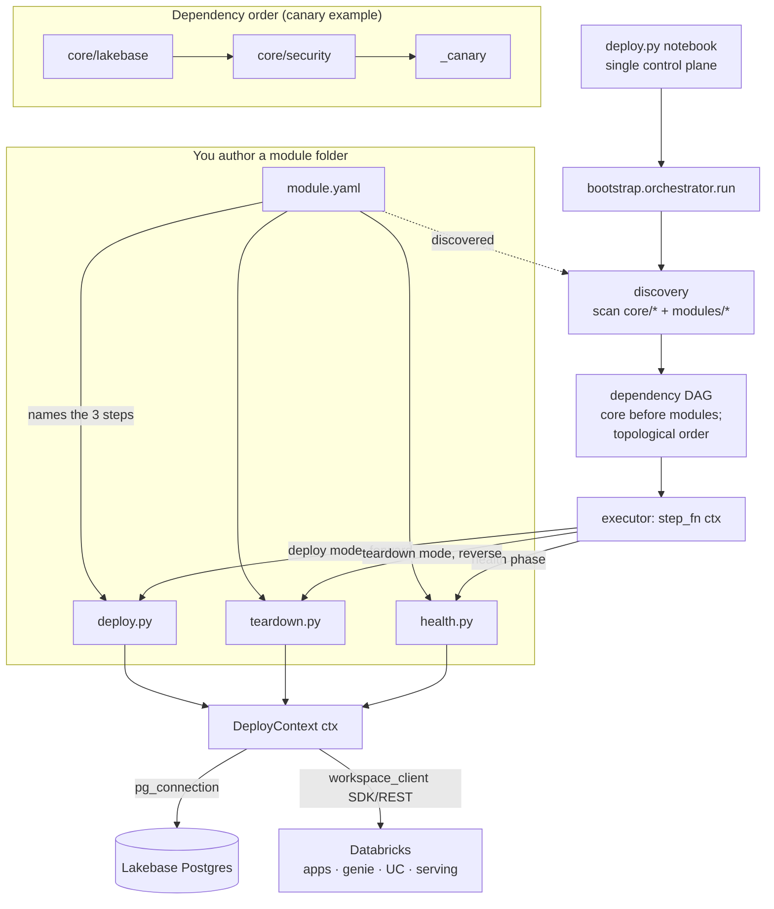

# `_canary` — the reference module (start here to author a module)

`_canary` is the **template** for building a workshop module. It is intentionally
tiny — it creates one schema and one `heartbeat` table — but it exercises the
**entire module contract** with real resources, so you can see every required
piece in one place. Copy this folder, rename it, and replace the body.

It also serves as the deploy smoke test: a green canary proves
**discovery → dependency ordering behind core → deploy → health → teardown**,
with **zero edits to the deploy notebook**.

---

## What every module is made of (the required components)

A module is a folder under `modules/<name>/` containing exactly these four files:

| File | Required symbol | Responsibility |
|---|---|---|
| `module.yaml` | — | The **manifest**: `name`, `kind: module`, `personas`, `depends_on`, `parameters`, `features` (maturity), `provides`, and the three step filenames. This is the contract the orchestrator reads. |
| `deploy.py` | `def deploy(ctx)` | **Provision** the module's resources (idempotently). Returns a small status dict. |
| `teardown.py` | `def teardown(ctx)` | **Remove** everything deploy created. Runs in reverse order; best-effort. |
| `health.py` | `def health_check(ctx)` | **Prove** it works (e.g. a `SELECT`). Returns `healthy: True/False`. |

Drop the folder in — discovery and the dependency DAG pick it up automatically.

### The `module.yaml` fields, explained

| Field | What it does |
|---|---|
| `name` | Slug that namespaces the module (matches the folder). |
| `kind: module` | Distinguishes a module from an always-on `core` component. |
| `personas` | Which customer personas this serves (DBA, App Dev, AI Eng, …). |
| `enabled_by_default` | `false` for modules — opt in via the deploy notebook's `modules` multiselect. |
| `depends_on.core` | Core components that must deploy first (canary needs `lakebase`, `security`). The DAG guarantees the order. |
| `parameters` | Deploy-time inputs (tiered required / optional / advanced). |
| `features` | Databricks features this module uses **with their maturity** (GA / Public Preview / Beta) — aggregated into the customer-facing feature matrix. |
| `provides` | Resources the module creates (for teardown + as-built reporting). |
| `entrypoint` / `teardown` / `health_check` | The three step filenames above. |

---

## How it plugs into the platform

*The canary declares `depends_on.core: [lakebase, security]`, so the DAG always
runs it **after** those — and tears it down **before** them.*

---

## What the canary actually does

- **deploy** — as the admin identity over psycopg, idempotently
  `CREATE SCHEMA IF NOT EXISTS canary` + `canary.heartbeat`, then insert one row.
- **health** — `SELECT count(*) FROM canary.heartbeat` and assert ≥ 1 row.
- **teardown** — `DROP SCHEMA IF EXISTS canary CASCADE`.

Every step guards live work behind `ctx.is_live()` and returns `{"status": "stub"}`
off-Databricks, so the offline test suite runs with no network.

**Depends on:** core `lakebase`, `security`.
**Provides:** `pg_schemas` (`canary`), `pg_tables` (`canary.heartbeat`).

---

## Authoring your own module

1. Copy `modules/_canary/` to `modules/<your_module>/`.
2. Edit `module.yaml`: set `name`, `personas`, `depends_on.core`, `parameters`,
   and declare each Databricks `features` entry with its maturity.
3. Replace the bodies of `deploy.py` / `teardown.py` / `health.py`, keeping the
   contract rules (stub guard, idempotent, small result dict, no secrets in it).
4. That's it — no deploy-notebook edits. Select it in the `modules` multiselect.

See [`docs/MODULE_AUTHORING.md`](../../docs/MODULE_AUTHORING.md) for the full guide
and [`modules/field_service/`](../field_service/) for a large, real example.
