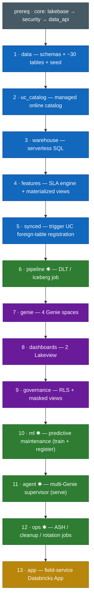

# `field_service` — full field-service workshop solution

The first **real** module: a complete Telco field-service solution reworked from
the Lakebase FSM demo. It exercises the module contract end-to-end with real
assets and covers **all five personas** (DBA, ETL, App Dev, AI Engineer,
Technical Leadership).

It depends only on core (`lakebase`, `security`, `data_api`) and is **fully
self-provisioning** — it stands up every dependency it needs (UC catalog, SQL
warehouse, data, pipeline, Genie, dashboards, ML, agent, app) and tears it all
down. Nothing pre-existing is assumed.

## What it provisions (internal step pipeline)

The module runs an ordered internal sub-pipeline (`fs_steps.ORDERED_STEPS`).
Each step is idempotent, best-effort (defers rather than aborting), and gated
where noted; teardown runs the pipeline in reverse.

Deploy runs the steps top-to-bottom (teardown runs them bottom-to-top):



**✱ gated** by `include_pipeline` / `include_ml` / `include_agent` /
`include_ops_jobs` (all default on). `genie` + `dashboards` run **after**
`synced` because the managed online catalog registers Lakebase tables as foreign
tables lazily (on first query); `synced` triggers + waits for that so Genie's
table validation passes.

## Feature maturity

Declared in `module.yaml` (`features`) and surfaced in the feature matrix:

| Feature | Maturity |
|---|---|
| Genie spaces, Lakeview dashboards, DLT pipelines, Managed Iceberg, Model Serving, Agent Framework, Databricks Apps | GA |
| Lakebase → Unity Catalog synced online tables | **Public Preview** |

## Parameters

`warehouse_size`, `seed_volume` (`demo`/`scale`), and the gate toggles
`include_pipeline` / `include_ml` / `include_agent` / `include_ops_jobs`.

## Layout

```
module.yaml     manifest (depends_on, params, features, provides)
deploy.py       runs the sub-pipeline forward (best-effort per step)
teardown.py     runs it in reverse
health.py       aggregates per-step health
fs_steps.py     the ORDERED_STEPS registry + step implementations
fs_sql.py       SQL splitter/scale + apply helpers (seeding)
assets/         vendored source: sql/ genie/ dashboards/ pipeline/ notebooks/ app/
```
